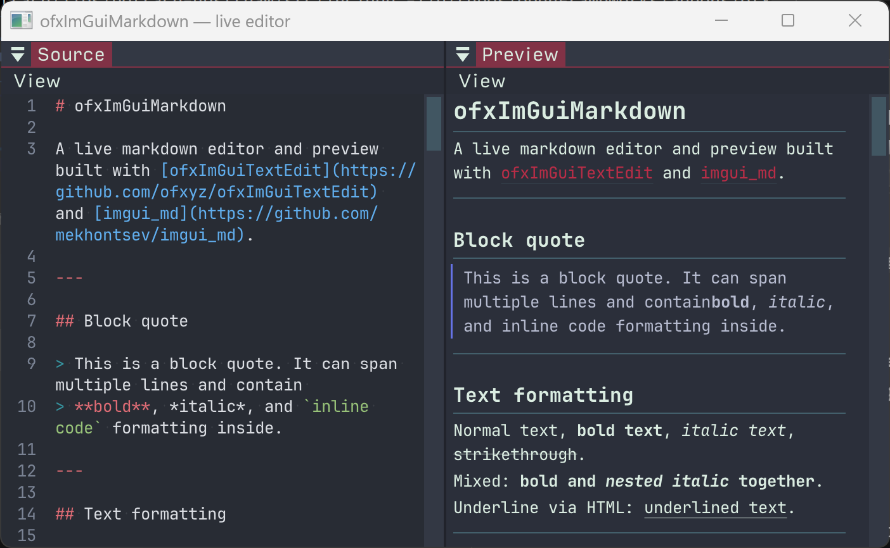

# ofxImGuiMarkdown

Markdown preview widget for [Dear ImGui](https://github.com/ocornut/imgui) inside openFrameworks, built on top of [imgui_md](https://github.com/mekhontsev/imgui_md) and [MD4C](https://github.com/mity/md4c).



## Supported Markdown Features

Everything below is implemented and exercised by `example-markdownEditor`:

| Category | Features |
|----------|----------|
| **Structure** | Paragraphs, soft-wrapped text, headers (H1–H6), horizontal rules |
| **Emphasis** | **Bold**, *italic*, ***bold+italic*** (nested or combined), ~~strikethrough~~, `<u>underline</u>` |
| **Lists** | Ordered and unordered lists, including nested sub-lists |
| **Links** | `[label](url)` — opens via `ofLaunchBrowser`; `[[Page\|label]]` wiki links (styled, clickable) |
| **Images** | `` — **all raster formats `ofImage` loads** (FreeImage), plus **SVG preview** (`ofxSvg`); cached; optional `http(s)://` URLs |
| **Quotes** | Block quotes with left bar and tinted text |
| **Code** | Inline `` `code` `` spans and fenced blocks with syntax highlighting (`ofxImGuiTextEdit`) |
| **Tables** | Resizable columns, borders, alternating row background, bold headers (stretch to panel width) |
| **HTML** | `<br>`, `<hr>`, `<u>`, `</u>`, `<div class="...">`, `</div>` (style via `html_div()` override) |
| **Other** | Backslash escapes, `&nbsp;` entity |

Word wrap uses font measurement by default. When **ofxUnicode** is linked, line breaks also follow Unicode rules for the configured `wrapLanguage` (default `"en"`).

### Not supported (yet)

These MD4C constructs are parsed by the underlying library but have empty handlers in `imgui_md` — they render as plain text or are skipped:

- **LaTeX math** — inline (`$...$`) and display (`$$...$$`) — requires `MD_FLAG_LATEXMATHSPANS` (not enabled)
- **Task lists**, **spoilers**, **sup/sub scripts**, **admonitions** — other optional MD4C extensions (not enabled)

Raw HTML blocks beyond the tags listed above are ignored. `<div class="...">` emits enter/leave callbacks but has no default styling — subclass and override `html_div()` to style named classes.

### Font coverage

With bundled **ofxImGuiStyle** fonts, all emphasis styles have a dedicated JetBrains Mono face:

| Renderer field | JetBrains Mono | Used for |
|----------------|----------------|----------|
| `regularFont` | Regular | Body text |
| `boldFont` | Bold | **Bold**, table headers |
| `italicFont` | Italic | *Italic* |
| `boldItalicFont` | **BoldItalic** | ***Bold + italic*** (nested `**…*…*…**` or `*…**…**…*`) |
| `monoFont` | Regular | Inline and fenced code |
| `headingFont` | Bold @ larger size | H1 (example uses 22 px) |
| `h2Font` | optional | H2 only; when unset, H2 uses `headingScale[2]` |
| *(H3–H6)* | `boldFont` / `regularFont` | Sized by `headingScale[3]` … `[6]` |

That is **full variant coverage** for the bundled monospace family. It is **not** 100% MD4C/imgui_md feature coverage — see [Not supported](#not-supported-yet) above.

## Dependencies

| Addon | Role |
|-------|------|
| `ofxImGui` | ImGui integration |
| `ofxImGuiTextEdit` | Fenced code blocks with language highlighting |
| `ofxSvg` | SVG image loading |
| `ofxUnicode` | Optional — Unicode-aware line breaking in preview wrap |
| `ofxImGuiStyle` | Optional — bundled Input Sans + JetBrains Mono (no disk font files) |

## Usage

```cpp
#include "ofxImGuiMarkdown.h"
#include "ImFonts.h"

// --- In your ofApp class ---
ofxImGui::Gui gui;
ofxMarkdownRenderer renderer;

// --- setup() ---
ofDisableArbTex(); // before textures / gui.setup() — see Images below
gui.setup();

// Bundled fonts (ofxImGuiStyle):
if (ImFont* ui = ImFonts::LoadDefaultFonts(ImGui::GetIO().Fonts, 15.f))
    gui.setDefaultFont(ui);

ImFonts::JetBrainsMonoFonts jbm = ImFonts::LoadJetBrainsMono(ImGui::GetIO().Fonts, 15.f);
renderer.regularFont    = jbm.regular;
renderer.boldFont       = jbm.bold;
renderer.italicFont     = jbm.italic;
renderer.boldItalicFont = jbm.boldItalic;
renderer.monoFont       = jbm.regular;
renderer.headingFont    = ImFonts::LoadJetBrainsMonoFont(
    ImGui::GetIO().Fonts, 22.f, ImFonts::JetBrainsMonoVariant::Bold);
gui.rebuildFontsTexture();

// Or load from disk via gui.addFont():
// renderer.regularFont    = gui.addFont(ofToDataPath("fonts/MyRegular.ttf"), 15.0f);
// renderer.boldFont       = gui.addFont(ofToDataPath("fonts/MyBold.ttf"), 15.0f);
// renderer.italicFont     = gui.addFont(ofToDataPath("fonts/MyItalic.ttf"), 15.0f);
// renderer.boldItalicFont = gui.addFont(ofToDataPath("fonts/MyBoldItalic.ttf"), 15.0f);

// --- draw() ---
gui.begin();
if (ImGui::Begin("Markdown Preview")) {
    renderer.render(myMarkdownString);
}
ImGui::End();
gui.end();
```

### Convenience Free Function

For simple cases without custom fonts, use the free function which keeps a shared static renderer:

```cpp
gui.begin();
if (ImGui::Begin("Preview")) {
    ofxRenderMarkdown(markdownText);
}
ImGui::End();
gui.end();
```

### Images

Inline images use the same loaders as openFrameworks itself — not a hand-picked subset.

**Raster** — anything [`ofImage`](https://openframeworks.cc/documentation/graphics/ofImage/) can read via FreeImage, including:

| Common | Also supported |
|--------|----------------|
| PNG (`.png`) | BMP, ICO, TIFF (`.tif`/`.tiff`), TGA |
| JPEG (`.jpg`, `.jpeg`) | GIF (first frame), PSD, PPM/PGM/PBM |
| | EXR, HDR, DDS, WBMP, PCX, SGI, JP2, … |

Format detection is by file content and extension (FreeImage), so extensionless paths still work when the file is readable.

**Vector** — **SVG** (`.svg`) is rasterised through **ofxSvg** into an off-screen FBO at `svgScale` (default `2.0`) for crisp preview in ImGui. This is separate from `ofImage` because openFrameworks does not load SVG as a bitmap natively.

**Paths** — resolved in order: path as written (relative to the app’s working directory, usually `bin/`), then `ofToDataPath()`. Example: `data/photo.tiff` or `photo.tiff` in `bin/data/`.

**Remote** — `http://` and `https://` URLs work for **raster** images (`ofImage` network load). SVG URLs are not fetched automatically.

Images are loaded on first encounter and cached for the lifetime of the renderer. Call `renderer.clearImageCache()` after a GL context rebuild or to force a reload.

Failed loads are skipped silently (no broken-image placeholder). Check the verbose log for `"Image not loaded:"` messages.

**Important:** ARB textures must be disabled before images are loaded so that texture coordinates are normalised to 0–1 (as ImGui requires). Call `ofDisableArbTex()` once in `setup()` before `gui.setup()`:

```cpp
void ofApp::setup() {
    ofDisableArbTex();
    gui.setup();
    // ...
}
```

To cap display width (aspect ratio preserved):

```cpp
renderer.maxImageWidth = 400.0f; // pixels; 0 = auto-fit to window width
```

For sharper SVG on HiDPI displays:

```cpp
renderer.svgScale = 2.0f; // 1.0 = native SVG units, 2.0 = 2× supersampling
```

To customise loading (URLs, tint, placeholders), subclass `ofxMarkdownRenderer` and override `get_image()`:

```cpp
struct MyRenderer : public ofxMarkdownRenderer {
    bool get_image(image_info& nfo) const override {
        // m_href contains the image path/URL from the markdown source
        nfo.texture_id = (ImTextureID)(uintptr_t)myTexture.getTextureData().textureID;
        nfo.size       = { 200, 150 };
        nfo.uv0        = { 0.0f, 0.0f };
        nfo.uv1        = { 1.0f, 1.0f };
        nfo.col_tint   = { 1.0f, 1.0f, 1.0f, 1.0f };
        nfo.col_border = { 0.0f, 0.0f, 0.0f, 0.0f };
        return true;
    }
};
```

### Wiki links

MD4C wiki-link syntax is enabled: `[[Page]]`, `[[Page|label]]`, `[[path/to/Page]]`, `[[https://example.com|Example]]`, and `[[#anchor]]`.

Wiki links use the same link styling as `[text](url)` (colour, underline, tooltip showing the target). On click:

- **Regular markdown links** — always open in the system browser via `ofLaunchBrowser`.
- **Wiki links** — call `onWikiLinkClicked` when set; otherwise URL-like targets open in the browser and local page names are resolved with `resolveWikiPagePath()` (logged if no handler is installed).

```cpp
renderer.wikiLinkBasePath = ofToDataPath("", true); // bare "Notes" -> data/Notes.md

renderer.onWikiLinkClicked = [&renderer](const std::string& target) {
    const std::string path = renderer.resolveWikiPagePath(target);
    if (!path.empty() && ofFile::doesFileExist(path))
        loadMarkdownFile(path);
    else if (target.find("://") != std::string::npos)
        ofLaunchBrowser(target);
};
```

`example-markdownEditor` loads `data/README.md` when you click `[[README|README]]`.

## Example

`example-markdownEditor` — a docked live editor/preview split using `ofxImGuiTextEdit` (Markdown language, soft wrap) on the left and `ofxMarkdownRenderer` on the right. Edit markdown source and see the rendered output update in real time.

Requires `ofxImGui`, `ofxImGuiTextEdit`, `ofxImGuiStyle`, `ofxSvg`, and optionally `ofxUnicode` in `addons.make`.

## Vendored Libraries

| Library | Source | License |
|---------|--------|---------|
| [imgui_md](https://github.com/mekhontsev/imgui_md) | `libs/imgui_md/src/` | MIT |
| [MD4C](https://github.com/mity/md4c) | `libs/md4c/src/` | MIT |
